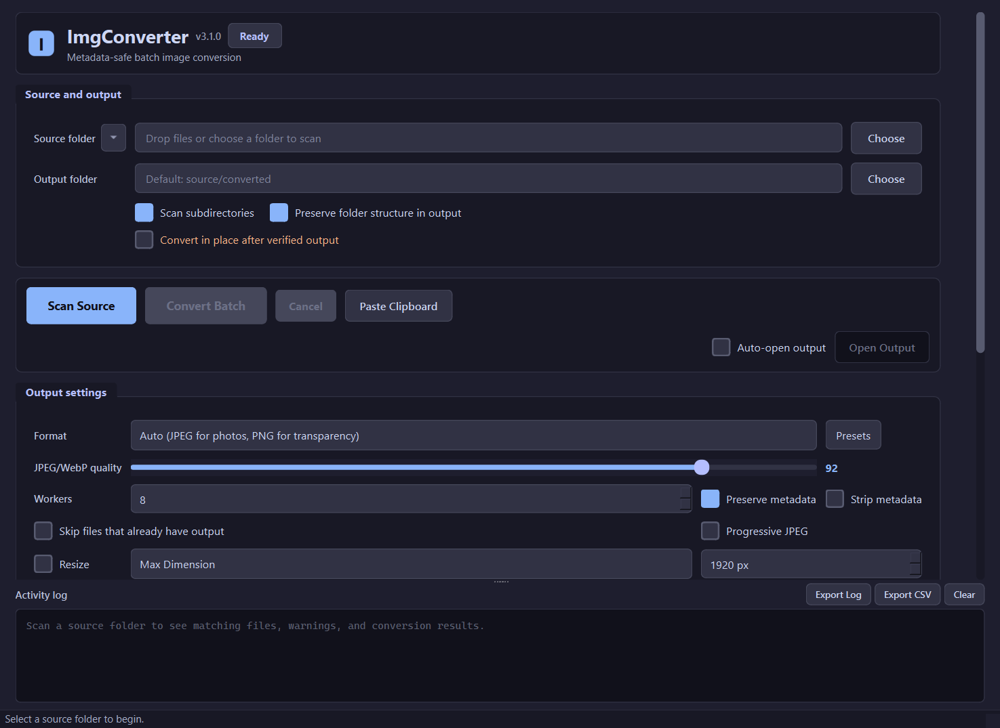

# ImgConverter

Universal image batch converter with a modern, local-first GUI. Scans directories recursively and converts JPEG, PNG, HEIC, AVIF, WebP, JPEG XL, Camera RAW, TIFF, BMP, JPEG 2000, QOI, and ICO files to JPEG, PNG, WebP, AVIF, TIFF, or JPEG XL with full metadata preservation.




## Why ImgConverter?

Most image converters get the details wrong — they strip metadata, mangle colors by dropping ICC profiles, or use lossy 4:2:0 chroma subsampling by default. ImgConverter is built on research into what existing tools do poorly:

| Problem | Other Tools | ImgConverter |
|---|---|---|
| **Color accuracy** | ImageMagick strips ICC profiles with `-strip`, causing Display P3 → sRGB color shift | Passes ICC profiles through to output — colors stay accurate |
| **Chroma subsampling** | Most default to 4:2:0 (halves color resolution) | Uses 4:4:4 — full color fidelity |
| **Format selection** | Force you to pick JPEG or PNG for everything | Auto-detects: JPEG for photos, PNG only when transparency exists |
| **Metadata** | Online converters and many CLI tools strip EXIF/GPS/timestamps | Preserves EXIF, ICC, and XMP data by default |
| **Performance** | Single-threaded or limited concurrency | Parallel conversion with configurable worker count (up to 32) |
| **Format coverage** | Most only handle HEIC or one format at a time | 12+ input format families from a single tool |
| **Privacy** | Free online converters upload your images to remote servers — FBI/IC3 warned (March 2025) some install ransomware or scrape EXIF GPS data | Runs entirely offline. Your files never leave your machine |

## Supported Input Formats

| Format | Extensions | Decoder | Availability |
|---|---|---|---|
| JPEG | `.jpg` `.jpeg` `.jpe` `.jfif` | Pillow | Required |
| PNG | `.png` | Pillow | Required |
| HEIC/HEIF | `.heic` `.heif` `.hif` | pillow-heif | Required |
| AVIF | `.avif` | pillow-heif | Required |
| WebP | `.webp` | Pillow | Required |
| TIFF | `.tif` `.tiff` | Pillow | Required |
| BMP | `.bmp` | Pillow | Required |
| JPEG 2000 | `.jp2` `.j2k` `.jpx` | Pillow | Required |
| ICO/CUR | `.ico` `.cur` | Pillow | Required |
| JPEG XL | `.jxl` | pillow-jxl-plugin | Optional |
| Camera RAW | `.cr2` `.cr3` `.nef` `.arw` `.dng` `.orf` `.rw2` `.raf` | rawpy/libraw | Optional |
| QOI | `.qoi` | Pillow | Required |

**Output formats:** JPEG, PNG, WebP, AVIF, TIFF, JPEG XL

**Optional tools:**

| Tool | Purpose | Install |
|---|---|---|
| `pillow-jxl-plugin` | JPEG XL input + output | `pip install pillow-jxl-plugin` |
| `rawpy` | Camera RAW | `pip install rawpy` |
| `exiftool` | Recovers MakerNotes / GPS sub-IFDs / IPTC / sidecar XMP that Pillow drops silently | [exiftool.org](https://exiftool.org/) |
| `watchdog` | Lower-latency filesystem events for `--watch` mode; polling remains the fallback | `pip install watchdog` |
| `c2pa-python` | Native C2PA manifest verification before falling back to `c2patool` | `pip install c2pa-python` |
| `ssimulacra2` | SSIMULACRA2 perceptual quality metric for `--target-ssimulacra2` | `pip install ssimulacra2` |

Run `imgconverter --install-deps` to install all required + optional Python packages, or `pip install -r requirements.txt`. If a format-specific decoder is missing, that family is skipped gracefully and the app logs which are unavailable. `exiftool` is detected automatically when present on `PATH`; pass `--no-exiftool` to disable the tag-copy pass.

## Features

- **Batch editing layer** — per-image adjustments (brightness, contrast, saturation, sharpness, blur, hue), tonal toggles (grayscale, sepia, invert), effects (vignette, film grain, color tint), a solid border, one-shot look presets (`--adjust-preset vivid|muted|bw|vintage|cold|warm`), and social-media size presets (`--social instagram-post`, …). Applied across the whole batch, alpha-preserving, and stackable with resize/canvas/watermark
- **Auto format detection** — JPEG for photos, PNG when alpha channel is present
- **12+ input formats** — JPEG, PNG, HEIC, AVIF, WebP, JXL, RAW, TIFF, BMP, JP2, QOI, ICO
- **Cross-format conversion** — convert between any formats (JPEG to WebP, PNG to JPEG, etc.); same-format no-ops auto-skipped
- **AVIF output** — next-gen AV1 codec via Pillow's native encoder, best compression ratio
- **JPEG XL output** — next-gen JPEG replacement via pillow-jxl-plugin (quality + effort tuning). Browser support: Safari 17+ (default), Chrome 145+ (flag, expected default H2 2026), Firefox 152+ (Labs)
- **CSV export** — structured conversion report with per-file status, sizes, timing, and warnings
- **Persistent batch history** — completed GUI and CLI batches append a redacted local summary with counts, byte deltas, options, and report/support-bundle pointers
- **CLI mode** — headless conversion via `--input` flag with full feature parity (all GUI options exposed as flags)
- **Plugin trust manager** — GUI inventory for trusted, changed, missing, and untrusted file or package entry-point plugins without executing them
- **In-place conversion** — convert next to the original and delete the source file
- **Atomic writes** — in-place mode uses temp file + atomic rename for crash-safe conversion
- **Output validation** — verifies file exists, size > 0, and passes integrity check before accepting
- **Disk space pre-check** — blocks conversion if estimated output exceeds available space, warns at 80%
- **Strip metadata** — option to remove all EXIF/ICC/XMP from output files
- **Auto-open output folder** — automatically opens the output folder when conversion finishes
- **File count in title bar** — shows file count after scan, progress during conversion, summary when done
- **Resize upscaling guard** — warns when image is already smaller than the resize target
- **Conversion presets** — Web Optimized, Archive Quality, Mobile Friendly, Print/TIFF one-click presets
- **Premium workflow workspace** — a clear Source → Output recipe → Batch summary layout keeps the next action visible and the activity log supporting, not dominant
- **Responsive composition** — two-pane layout on wide screens, stacked source/summary flow on compact windows, and reachable expert controls from 760×560 through 4K+
- **Contextual batch summary** — purposeful empty, scanning, ready, converting, stopped, partial-failure, failed, and complete states with dynamic “Convert N images” copy
- **Unified line-icon system** — consistent theme-aware actions and an ImgConverter-specific app/package mark replace platform-dependent glyphs and legacy branding
- **Polished management dialogs** — plugin trust, batch history, automation, duplicate review, commands, and file-manager integration share clear hierarchy, status feedback, and actionable empty states
- **True collapsed advanced controls** — input-family filters and advanced output controls stay out of the primary Source → Recipe path until expanded
- **Smart option visibility** — format-specific controls auto-show/hide based on output format
- **Dark title bar** — native dark title bar on Windows 10/11 matching Catppuccin theme
- **Conversion speed stats** — elapsed time + files/sec displayed in status bar during conversion
- **Log context menu** — right-click for Copy Selection, Copy All, Open File Location
- **Source/output overlap guard** — prevents output directory from overwriting source files
- **Drag & drop** — drop folders or individual image files onto the window
- **Format filter** — per-family checkboxes to include or exclude input formats from scanning
- **Skip existing** — resume interrupted batches by skipping files where output already exists
- **EXIF auto-rotate** — applies orientation from EXIF metadata before saving (prevents double-rotation)
- **Image resize** — Max Dimension (px) or Scale (%) with LANCZOS resampling
- **Filename prefix/suffix** — prepend or append text to output filenames
- **Progressive JPEG** — optional progressive encoding for web-optimized output
- **Lossless WebP** — optional lossless mode when WebP is selected as output
- **JPEG chroma subsampling** — toggle between 4:4:4 (default, max fidelity) and 4:2:0 (smaller files)
- **sRGB color conversion** — convert embedded ICC profiles (Display P3, Adobe RGB, etc.) to sRGB
- **TIFF compression** — None, LZW, or Deflate when TIFF output is selected
- **PNG compression level** — adjustable 1–9 for PNG output (default 6)
- **Recent directories** — dropdown of last 10 source directories for quick re-access
- **Metadata preservation** — EXIF, ICC color profiles, XMP
- **Parallel conversion** — 1–32 workers via ThreadPoolExecutor
- **Recursive scanning** — processes entire directory trees
- **Folder structure preservation** — mirrors source layout in output (optional)
- **Quality control** — adjustable slider (50–100) for JPEG/WebP/AVIF
- **Scan breakdown** — shows count per format family after scanning
- **Live stats** — files found, total size, converted, skipped, failed, space saved
- **Progress ETA** — shows current filename and estimated time remaining
- **Completion notification** — system tray balloon + notification sound when batch finishes
- **Embedded log** — per-file results with timing and size delta, export to file or clear
- **Cancel support** — stop mid-conversion without corrupting output
- **Settings persistence** — remembers all settings including format filter state across sessions
- **Catppuccin Mocha dark theme** — including dark scrollbars and dark title bar
- **Accessible interaction states** — visible focus, hover, pressed, selected, checked, disabled, validation, progress, and semantic status treatments across the full GUI
- **Cross-platform** — native file manager integration on Windows, macOS, and Linux

## Installation

```bash
git clone https://github.com/SysAdminDoc/ImgConverter.git
cd ImgConverter
python -m pip install -r requirements.txt
python imgconverter.py
```

Dependencies are explicit and are not installed silently at startup. Run `python imgconverter.py --install-deps` if you want ImgConverter to install or upgrade its required and optional Python packages for you.

GitHub release binaries are unsigned until platform signing infrastructure is available. Each release includes `SHA256SUMS`, per-binary `.sha256`, `.dependencies.txt`, `.sbom.json`, and `.provenance.json` files so downloads can be verified before use.

## Usage

1. In **Source**, choose or drag in a folder (or individual images) and confirm the output folder
2. In **Output recipe**, choose the format, quality, metadata policy, and optional preset
3. Select **Scan source** to review matching files and estimated output details
4. Select the contextual **Convert N images** action in **Batch summary**
5. Expand **Advanced options** or **Input format filters** only when the workflow needs them; output defaults to `source/converted/`

Toggle **"Convert in place after verified output"** to save output next to each source file and delete the original after validation succeeds.

Enable **"Skip files that already have output"** to resume interrupted batches without re-converting.

The collapsible Activity panel shows per-file results with size before/after and conversion time. Activity can be exported to text, CSV, or a redacted diagnostics bundle. Completed batches are also recorded in Batch History without source images or full private paths. CSV and JSON reports include metadata/provenance presence checks for EXIF, ICC, XMP, IPTC, MakerNotes, and C2PA; warnings call out fields that were detected before conversion but missing afterward. Diagnostics bundles include app/platform/dependency/tool details and recent redacted activity, but never include source images.

## CLI Usage

Run ImgConverter from the command line for scripted or headless operation. If `--input` is provided, the GUI is skipped entirely.

```bash
# Convert a directory to JPEG at quality 85
python imgconverter.py --input ./photos --format jpeg --quality 85

# Convert to WebP with 4 workers, output to specific folder
python imgconverter.py -i ./photos -o ./output -f webp -w 4

# Convert selected files directly
python imgconverter.py --files ./IMG_001.heic ./render.png -o ./output -f webp

# Dry run — list files that would be converted
python imgconverter.py --input ./photos --dry-run

# In-place conversion (saves next to originals, deletes source)
python imgconverter.py --input ./photos --in-place

# Strip metadata and resize
python imgconverter.py --input ./photos --strip-metadata --resize max_dim:1920

# Convert to AVIF with sRGB color conversion
python imgconverter.py --input ./photos --format avif --srgb

# Convert to JPEG XL (requires pillow-jxl-plugin)
python imgconverter.py --input ./photos --format jxl --quality 90

# Resize by scale percentage
python imgconverter.py --input ./photos --resize scale:50

# TIFF with LZW compression
python imgconverter.py --input ./photos --format tiff --tiff-compression lzw

# Editing: apply a "vintage" look with extra contrast and a white border
python imgconverter.py -i ./photos -f jpeg --adjust-preset vintage --contrast 10 --border 24

# Editing: grayscale + vignette + film grain
python imgconverter.py -i ./photos -f webp --grayscale --vignette 40 --grain 20

# Editing: resize + tint + export at Instagram post size
python imgconverter.py -i ./photos -f jpeg --tint "#3a6ea5@25" --social instagram-post

# Progressive JPEG with filename prefix, skip already-converted
python imgconverter.py -i ./photos -f jpeg --progressive --prefix "web_" --skip-existing

# Print version
python imgconverter.py --version

# Export redacted diagnostics for support
python imgconverter.py --support-bundle ./imgconverter_support.zip

# Print redacted local batch history
python imgconverter.py --history
```

**CLI flags:**

| Flag | Description |
|---|---|
| `-i`, `--input` | Source file or directory (enables CLI mode) |
| `--files PATH...` | One or more selected files/directories, used by shell integration |
| `-o`, `--output` | Output directory (default: `<input>/converted`) |
| `-f`, `--format` | Output format: `auto`, `jpeg`, `png`, `webp`, `avif`, `tiff`, `jxl`, or a trusted plugin encoder format |
| `-q`, `--quality` | JPEG/WebP quality 50–100 (default: 92) |
| `-w`, `--workers` | Parallel worker count (default: min(cpu_count, 8)) |
| `--in-place` | Convert next to originals, delete source |
| `--recursive` | Scan subdirectories (default) |
| `--no-recursive` | Only scan top-level directory |
| `--dry-run` | List files and exit without converting |
| `--proof N` | Convert N representative files to a temp folder, report size deltas, then exit |
| `--strip-metadata` | Remove all EXIF/ICC/XMP from output |
| `--strip-gps` | Strip GPS/location data while preserving copyright and color profiles |
| `--strip-device` | Strip camera make/model/serial numbers (combine with `--strip-gps` for full privacy) |
| `--resize` | Resize images, e.g. `max_dim:1920` or `scale:50` |
| `--skip-existing` | Skip files where output already exists |
| `--progressive` | Save JPEGs as progressive |
| `--chroma-420` | Use 4:2:0 chroma subsampling for JPEG |
| `--lossless` | Save WebP in lossless mode |
| `--srgb` | Convert embedded ICC profiles to sRGB |
| `--prefix` | Prepend text to output filenames |
| `--suffix` | Append text to output filenames |
| `--template STR` | Output filename template with tokens (overrides prefix/suffix). Tokens: `{stem}` `{ext}` `{fmt}` `{src_dir}` `{rel_dir}` `{width}` `{height}` `{date[:FMT]}` `{seq[:###]}`. Example: `--template '{rel_dir}/{stem}_{width}x{height}'` |
| `--report PATH` | Write structured per-file JSON report after conversion, including metadata/provenance before/after flags |
| `--support-bundle PATH` | Write a redacted diagnostic zip, then exit |
| `--history` | Print redacted local batch-session history as JSON, then exit |
| `--preset NAME` | Load a built-in or `~/.imgconverter/presets/NAME.json` preset before applying other flags |
| `--list-presets` | List built-in and user presets, then exit |
| `--export-preset NAME PATH` | Export a preset as a shareable JSON bundle with metadata and CLI equivalent |
| `--import-preset PATH` | Import a preset bundle JSON file into `~/.imgconverter/presets/` |
| `--exclude PATTERN` | Glob pattern to exclude from scan (repeatable) |
| `--no-exiftool` | Skip the ExifTool tag-copy pass (use Pillow's EXIF/ICC/XMP only) |
| `--install-deps` | Install/upgrade all required + optional Python deps, then exit |
| `--list-plugins` | List plugin files and trust status without loading them |
| `--trust-plugin PATH` | Trust a plugin in `~/.imgconverter/plugins/` by recording its SHA-256 |
| `--untrust-plugin NAME` | Remove a plugin from the local trust manifest |
| `--tiff-compression` | TIFF compression: `none`, `lzw`, `deflate` (default: none) |
| `--png-level` | PNG compression level 1–9 (default: 6) |
| `--no-structure` | Flatten output (no subdirectory mirroring) |
| `--avif-speed N` | AVIF encoding speed 0-10 (default: 6). Lower = smaller, slower |
| `--avif-codec CODEC` | AVIF encoder: `auto`, `aom`, `rav1e`, `svt` (default: auto) |
| `--png-lossy` | Run pngquant on PNG output for lossy size reduction |
| `--max-file-size SIZE` | Skip files larger than SIZE (e.g. `500MB`, `2GB`) |
| `--watermark SPEC` | Text or PNG watermark. Spec: `TEXT\|position\|opacity` |
| `--canvas WxH` | Pad output to canvas size with `--canvas-bg` fill |
| `--canvas-bg COLOR` | Canvas fill: `transparent`, hex color, or named color |
| `--brightness N` | Brightness adjustment `-100..100` (0 = none) |
| `--contrast N` | Contrast adjustment `-100..100` (0 = none) |
| `--saturation N` | Saturation adjustment `-100..100` (0 = none) |
| `--sharpness N` | Sharpen `0..100` via unsharp mask (0 = none) |
| `--blur PX` | Gaussian blur radius `0..20` px (0 = none) |
| `--hue DEG` | Hue rotation `0..360` degrees |
| `--grayscale` | Convert output to grayscale |
| `--sepia` | Apply a sepia tone |
| `--invert` | Invert colors (negative) |
| `--vignette N` | Radial edge darkening `0..100` (0 = none) |
| `--grain N` | Film-grain noise overlay `0..100` (0 = none) |
| `--tint COLOR@N` | Color tint, e.g. `#3a6ea5@20` or `teal@30` (strength `0..100`) |
| `--border PX` | Solid border width in px (0 = none) |
| `--border-color COLOR` | Border color: `#RRGGBB` or named (default `#ffffff`) |
| `--adjust-preset NAME` | Named look before explicit flags: `vivid`, `muted`, `bw`, `vintage`, `cold`, `warm`. Numeric flags stack on top; toggles OR together |
| `--social PRESET` | Pad to a social-media canvas: `instagram-post`, `instagram-story`, `facebook-cover`, `facebook-header`, `x-header`, `youtube-thumbnail`, `linkedin-banner`, `og-image`. Overridden by an explicit `--canvas` |
| `--dpi N` | Set output DPI tag for JPEG/PNG/TIFF |
| `--icc PROFILE` | Embed ICC profile (`sRGB` or path to `.icc` file) |
| `--tone-map CURVE` | HDR tone mapping: `none`, `reinhard`, `hable`, `clip` |
| `--xmp-sidecar` | Emit `.xmp` sidecar alongside output |
| `--recompress` | Lossless JPEG→JPEG via jpegoptim/jpegtran |
| `--target-kb N` | Binary-search quality to hit target output size (KB) |
| `--target-psnr DB` | Binary-search quality to hit a minimum PSNR score |
| `--target-ssimulacra2 SCORE` | Binary-search quality to hit a minimum SSIMULACRA2 perceptual score (requires `ssimulacra2`) |
| `--only-if-smaller PCT` | Discard output if not PCT% smaller than input |
| `--frames MODE` | Multi-frame: `first`, `all`, `animate` (default: first) |
| `--register-shell` | Install OS shell integration for selected files/folders |
| `--unregister-shell` | Remove shell integration |
| `--use-cache` | Skip source/preset pairs that already converted successfully |
| `--clear-cache` | Delete the conversion hash cache and exit |
| `--resume` | Resume an interrupted CLI batch from the saved queue |
| `--watch` | Watch the input directory and convert new files as they arrive; uses watchdog events when installed, otherwise polling |
| `--watch-interval SEC` | Polling/debounce interval for `--watch` mode |
| `--cpu-priority {normal,low}` | Process priority: `low` keeps the system responsive during large batches |
| `--use-processes` | Use process workers instead of threads for conversion |
| `--sidecar-history` | Write per-output `.imgconverter.json` reproducibility sidecars |
| `--backend BACKEND` | Select `pillow` or experimental `vips` backend |
| `--backend-info` | Print backend capability JSON, then exit |
| `--backend-benchmark PATH` | With `--backend-info`, benchmark each available backend against one image |
| `--format-matrix` | Print input/output format capability matrix as JSON (support, metadata caveats, install hints), then exit |
| `--verify-quality` | Run optional external quality metrics after conversion |
| `--progress` | Emit JSON Lines per-file events to stderr for machine consumption |
| `--when-done ACTION` | Action after a clean batch: `nothing` (default), `close`, `sleep`, `shutdown`; skipped when any file fails so exit codes stay truthful |
| `--stdin-files` | Read file paths from stdin (one per line), mutually exclusive with `--input`/`--files` |
| `--stdin-null` | With `--stdin-files`, use NUL delimiter (for `find -print0`) |
| `--max-memory PCT` | Warn when free system memory drops below PCT% during conversion |
| `--dedup-warn` | Log near-duplicate image pairs using perceptual hashing (requires `imagehash`) |
| `--dedup-skip` | Skip near-duplicates, keeping only the largest in each group (requires `imagehash`) |
| `--version` | Print version and exit |

Parser, GUI, and README parity is guarded by `build_cli_parity_matrix()` and the test suite: every long CLI flag must be classified as GUI-backed, CLI-only, admin-only, or internal-only, and every user-facing flag must remain documented here.

Trusted plugins may register decoder, encoder, and storage shapes from `PLUGINS.md`. File plugins are pinned by file SHA-256, and package entry-point plugins are pinned by a digest of their installed module and distribution metadata files. Registered decoders are included in scans, registered encoders can be selected with `--format <fmt>` or from the GUI format menu, and registered storage schemes appear in the startup support summary.

`--backend pillow` is the default fidelity path. `--backend vips` is an experimental quality-only fast path for huge images; it requires explicit `--format` and `--strip-metadata`, and rejects Pillow-only transforms such as resize, watermark, canvas, tone-map, ICC override, quality targets, and XMP sidecars. Run `python imgconverter.py --backend-info` for the current capability matrix, or add `--backend-benchmark ./image.jpg` for an opt-in single-image timing report.

**Preset JSON:**

User presets live in `~/.imgconverter/presets/*.json`. Presets should include `schema_version: 2`; legacy GUI keys such as `fmt`, `progressive_jpeg`, and `png_compress_level` still load, while CLI-shaped keys such as `format`, `template`, `exclude`, `max_file_size`, `target_kb`, and `sidecar_history` now apply through the same normalized preset path in GUI and CLI.

```json
{
  "name": "AVIF Proof",
  "schema_version": 2,
  "format": "avif",
  "quality": 77,
  "template": "{rel_dir}/{stem}_{seq:###}",
  "avif_speed": 3,
  "avif_codec": "svt",
  "watermark": "Demo|bottom-right|0.6",
  "canvas": "1920x1080",
  "canvas_bg": "#101010",
  "exclude": ["cache/**", "*.tmp"],
  "max_file_size": "500MB",
  "target_kb": 200,
  "xmp_sidecar": true,
  "sidecar_history": true,
  "strip_metadata": true
}
```

**Exit codes:**

| Code | Meaning |
|---|---|
| 0 | All files converted |
| 1 | Partial failure (some converted, some failed) |
| 2 | Input error (bad path, malformed flag value) |
| 3 | Required dependency missing (e.g. `--format jxl` without `pillow-jxl-plugin`) |
| 4 | Disk full / not enough space for estimated output |
| 5 | User cancelled (Ctrl-C / Cancel button) |
| 6 | Every file in the batch failed |

## How It Works

```
Source Directory          ImgConverter                 Output
 photos/                                                converted/
  ├─ IMG_001.heic   ──→  pillow-heif decoder    ──→    ├─ IMG_001.jpg
  ├─ IMG_002.avif   ──→  Pillow processing      ──→    ├─ IMG_002.jpg
  ├─ shot.webp      ──→  EXIF/ICC passthrough   ──→    ├─ shot.jpg
  ├─ photo.cr2      ──→  rawpy demosaic         ──→    ├─ photo.jpg
  └─ render.qoi     ──→  Pillow QOI decoder     ──→    └─ render.jpg
```

## Tech Stack

- **[pillow-heif](https://github.com/bigcat88/pillow_heif)** — HEIC/HEIF/AVIF decoding
- **[pillow-jxl-plugin](https://github.com/niclas-niclas/pillow-jxl-plugin)** — JPEG XL decoding (optional)
- **[rawpy](https://github.com/letmaik/rawpy)** — Camera RAW demosaicing via libraw (optional)
- **[Pillow](https://python-pillow.org/)** — image processing, WebP/TIFF/BMP/JP2/ICO/QOI decoding, output encoding
- **[PyQt6](https://www.riverbankcomputing.com/software/pyqt/)** — GUI framework

## Known Limitations

- **HDR gain maps** in HEIC files are lost during conversion (no JPEG/PNG equivalent). Keep originals for HDR workflows.
- **Apple Live Photo** motion data and depth maps cannot be preserved in any static format.
- **Camera RAW metadata** — rawpy performs a full demosaic; EXIF is not carried through. Use ExifTool as a post-pass if needed.
- **QOI** has no metadata support by design — nothing to preserve.
- **HEIC odd dimensions** may produce artifacts in some downstream decoders (libheif/codec limitation).

## License

MIT
